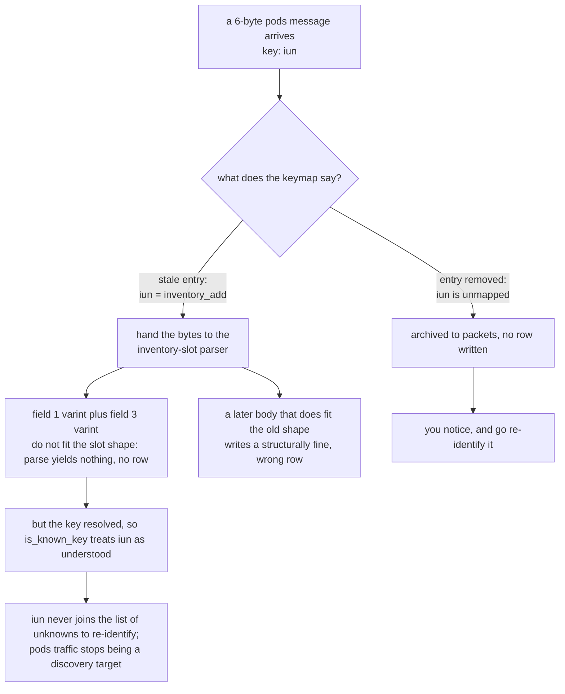
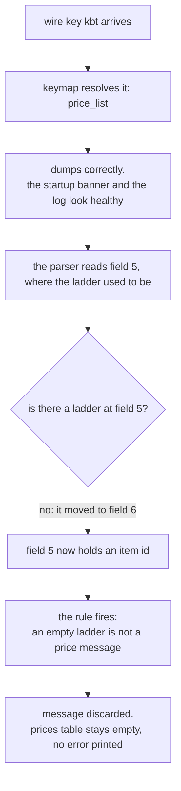
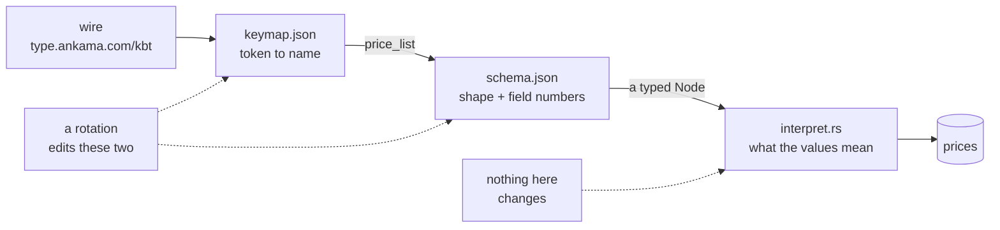

# The names rotate every patch, and one of them lied about it

*by Miou-zora · post 2 of 6 in [Notes from reverse-engineering a game protocol](README.md)*

> **The project.** [SniffSniffSquared](../README.md) reads the Dofus 3 game
> protocol off the wire, decodes it and writes what it understands to Postgres.
>
> **Where this sits.** [Post 01](01-the-traffic-was-never-encrypted.md)
> established that the traffic is plaintext protobuf, and that each message
> announces its type as a three-letter token in a `google.protobuf.Any` type
> URL: `type.ankama.com/kbt`. Those tokens are the only message identity there
> is. Everything downstream depends on knowing what `kbt` means.
>
> **What it answers.** What a game update does to a decoder that has ten of
> those tokens mapped, why a token that *survives* an update is more dangerous
> than one that breaks, and how to lay out the code so that recovering takes a
> text editor rather than a rewrite.

On 2026-08-04 a Dofus client update rotated the obfuscated message names on the
wire. I had 141 distinct keys from the session before it and 91 from the session
after, and 19 of them were shared. All ten messages I had identified and named
moved to new tokens.

That part was survivable, because a mapping that stops resolving fails loudly
and you go and re-identify it. The dangerous one was `iun`: the token stayed on
the wire while the message it used to name moved to `iua` with the rest. It
still resolved, it still parsed, and it now meant something completely
different. This post is about why that second case is worse than the first, and
about the code layout that makes recovering from either one an edit to two JSON
files rather than a rewrite.

## How much actually moved

The blunt count is 141 keys before, 91 after, 19 in common. But raw key counts
across two sessions are a weak measurement, because two sessions do different
things: browse a different shop, fight a different monster, and the key sets
diverge for reasons that have nothing to do with a patch.

So a tighter comparison is the first eighteen frames of each session, before any
player action — the same connection phase in both captures, here in order:

```
AUG 3   ksv jri jri jri jri knh kmw jri jrj jri jrj iwa jri iwa jrj iwa jri jpp
AUG 4   lqu hoy kqu mgq mgt hpd kqz krv mgz kqp kqp kvi jtg kvw kub jbf ipc kva
```

Eighteen frames each, one message per frame, and **not one token in common**.
The two token multisets are also shaped differently, so this shows the names
changed, not that the same messages still flow; the obfuscated names put a
message-for-message match out of reach. The ten named messages below are the
firmer reading, and every one of them moved.
The new build also emits `m*` and `h*` prefixes that the old one never produced
at all, which suggests the obfuscator is not permuting a fixed alphabet so much
as regenerating from a different seed.

Ten of my named messages went from one column to the other:

| message | before | after |
|---|---|---|
| `price_list` | `kea` | `kbt` |
| `chat_message` | `ksv` | `kti` |
| `crush_result` | `kfy` | `kfp` |
| `item_detail` | `kev` | `kfb` |
| `crush_request` | `ker` | `kbj` |
| `crush_slot_put` | `kch` | `kcr` |
| `inventory` | `iss` | `ivx` |
| `inventory_add` | `iun` | `iua` |
| `inventory_quantity` | `iul` | `ivj` |
| `inventory_remove` | `ivf` | `ium` |

Zero overlap between the two columns.

## The survivor that changed meaning

`iun` was in both sets. Before the update it was `inventory_add`, a new stack
arriving in the bags. After it, still on the wire, still arriving:

```
Aug 3  iun  24 B  0a16083f2212089c81b3a1011807209d3a2a05400148f201   an inventory slot
Aug 4  iun   6 B  08ff02189c35                                       {1: 383, 3: 6812}
```

The Aug 4 body decodes as two varint fields, which is what the `{1: …, 3: …}`
notation is shorthand for:

| bytes | field | value |
|---|---|---|
| `08 ff02` | 1 | 383 |
| `18 9c35` | 3 | 6812 |

Six bytes instead of twenty-four. Field 3 stayed constant across every sample I
had, and field 1 moved whenever I picked something up or crushed something.
That is current and maximum pods, the weight limit on your bags. It is not an
inventory addition and it never was.

Left mapped to `inventory_add`, `iun` still resolves, and that is where the
damage is:



**A stale mapping that still resolves is strictly worse than one that fails.**
A broken mapping costs you a message type until you notice. A wrong mapping
corrupts the table you were collecting the message for, silently, for as long as
you keep capturing, and it corrupts it with rows that look structurally fine.
There is no error to grep for.

This is the actual reason the ground-truth section at the top of my `CLAUDE.md`
opens with it. The instinct after a patch is to check which mappings broke. The
thing to check is which mappings *didn't*.

## The half that gets missed: the field numbers moved too

Repointing the keys is the obvious half of the recovery and it is not the whole
job. The same update also moved protobuf field numbers inside the messages.

Here is `price_list` measured on both builds:

| what it holds | wire type | 2026-07-10 | 2026-08-04 | |
|---|---|---|---|---|
| outer category | varint | field 1 | field 1 | unchanged |
| outer item id | varint | field 3 | field 2 | moved |
| outer offer | length-delimited | field 2 | field 3 | moved |
| offer item id | varint | field 1 | field 5 | moved |
| offer stat line | length-delimited | field 4 | field 4 | unchanged |
| offer ladder | packed | field 5 | field 6 | moved |
| offer listing | varint | field 7 | field 1 | moved |

Five of seven numbers moved. Across every message my interpreters read,
`crush_slot_put` was the only one whose numbers did not move at all.

The failure this produces is nastier than a broken key, because it looks like
success. Fix the keymap alone and the sniffer names every message correctly,
dumps every message correctly, prints a clean startup banner, and stores
nothing.



You watch a capture run for ten minutes with a healthy-looking log and an empty
`prices` table.

**No shape changed anywhere**, and that is the one mercy. Same nesting depth,
same wire types, same packed ladder, same repeated stat lines. The obfuscator
renumbers and renames; it does not restructure. So the recovery is mechanical
once you know to do it.

## What rotates becomes data; what does not stays code

The design rule that came out of this is one sentence: **anything the obfuscator
can change lives in a file, and anything that reflects how the game works lives
in Rust.**



Wire keys rotate, so no code anywhere names one. One module holds the mapping,
and its header states the rule:

> The obfuscated `Any` keys rotate between client builds: the key that meant
> "price list" in one build means nothing, or something else entirely, in the
> next. So nothing else in this codebase refers to a message by its wire key.
> Code says `price_list`; this module is the only place that knows the current
> key is `kea`.

That header still says `kea` while the `DEFAULTS` table right below it now reads
`price_list` -> `kbt`; a doc comment drifting out of step with the code beneath
it is the same failure this post is about, one file smaller.

The mapping itself is a flat table of semantic name against current wire key,
built into the binary as a default:

| semantic name | key on this build | what it carries |
|---|---|---|
| `price_list` | `kbt` | the marketplace ladder, x1 / x10 / x100 / x1000 |
| `chat_message` | `kti` | author, timestamp, free text |
| `crush_result` | `kfp` | what breaking an item yielded |
| `item_detail` | `kfb` | an instance uid — one specific copy of an item, not the item type — resolved to a type id and its rolls |
| … | … | ten of them in total |

One captured `price_list` had Carapace Verte at 75 / 326 / 6660 / 99999 for
those four batch sizes, and a 0 in any ladder slot means that batch is not on
sale, which is why the x1000 tier is often not there at all.

Everything downstream matches on the left column. The interpreter arm is
`"price_list" =>`, the dispatcher registers with
`messages::keymap().key("price_list")`, the tests assert against the name. A
rotation is a one-line edit here.

Better than that, it does not need to be an edit here at all.
`sniffer/keymap.json` overrides the defaults at startup, read from the working
directory:

```json
{ "price_list": "kbt", "chat_message": "kti" }
```

No rebuild, no toolchain, no Rust. It ships empty on purpose: the defaults match
the wire and are covered by tests over real captured bytes, so shipping a copy of
them in JSON would only invite the two to drift. Invalid JSON prints a warning
and keeps running on the defaults, because killing a capture in progress over a
missing comma is a worse outcome than ignoring the file.

Field numbers rotate too, so those went into a file as well. `sniffer/schema.json`
describes each message's shape *and* its numbers:

```json
"price_offer": { "fields": [
  { "n": 1, "name": "listing_id", "kind": "varint" },
  { "n": 4, "name": "stat", "kind": "message", "of": "stat_line", "repeated": true },
  { "n": 5, "name": "item_id", "kind": "varint" },
  { "n": 6, "name": "ladder", "kind": "packed" }
]}
```

`sniffer/src/schema.rs` walks that into a `Node`, and small adapters in
`interpret.rs` turn a `Node` into the typed struct the rest of the code wants.
Same as the keymap: loaded from the working directory, so a rotation needs no
rebuild, with the file compiled in as a fallback for a sniffer started from the
wrong directory.

## Meaning does not rotate, so meaning stays in Rust

The boundary matters more than either file, because the temptation once you have
a schema format is to keep pushing things into it until the Rust is a generic
interpreter and the JSON is the program.

These three rules live in `interpret.rs` and will never move:

- An empty ladder is not a price message.
- Quantity absent means one, not zero.
- A negative delta is a removal, not a placement.

None of them are structure. They are claims about how the game behaves, learned
by watching it, and no patch is going to relocate them to a different field
number. The schema says where the bytes are. Rust says what they are worth.

`crush_slot_put` is the clean illustration. Its body is a signed quantity delta
and an instance uid, seven bytes. The schema can tell you that field 1 is a
varint. It cannot tell you that a `-1` there means the player took the item back
out of the breaker rather than putting one in, which is the entire semantic
content of the message.

## The test suite that catches a subtly wrong schema

The failure mode of a schema file is not that it fails to parse. It is that it
parses into something plausible.

Two guards handle that. `Schema::parse` refuses a dangling submessage reference,
a reused field number and a reused field name at load time, before a byte of
capture is read, because each of those produces a working parser that reads the
wrong thing.

And the suite runs the same parsers against two builds. `sniffer/schema.json`
describes the current wire; `sniffer/testdata/schema-2026-07-10.json` describes
the previous one, so the fixtures captured on that build still run. Real bytes
from each, one set of parsers, two schemas. A change that is right for today's
wire and quietly wrong in general breaks the old fixtures.

All 74 tests run against captured bytes rather than synthesised ones, which is a
rule worth stating on its own: for a protocol with no specification, a
hand-written fixture is a record of what you *believed* the wire looked like, and
that is exactly the thing under test.

## What the recovery actually cost

The 2026-08-04 rotation moved every key and almost every field number in every
message I decode. The fix was:

1. Re-identify ten keys empirically, one deliberate in-game action each, against
   the packet archive. That is post 03.
2. Read the new field numbers off one item whose stats I already knew.
3. Edit `keymap.json` and `schema.json`.
4. Restart the sniffer and check two lines of the startup banner:

```
[*] message keymap: 10 entries (0 from keymap.json) — chat_message=kti … price_list=kbt
[*] message schema: 15 definitions from schema.json
```

No Rust changed. No rebuild. If that second line says `built-in`, the file was
rejected or you are in the wrong directory, and the reason prints above it.

The general form of this is older than obfuscated game protocols: **separate the
things that change on someone else's schedule from the things that change on
yours.** What made it concrete here is that the cost of getting it wrong is not
a compile error, it is a pods message the decoder keeps counting as understood
while it quietly means something else.

## Next

Step 1 above is the interesting one. Re-identifying ten messages with no schema,
no source and no client instrumentation turns out to be tractable, and one of
the three techniques needs nothing on screen at all: the packet archive can be
used as its own ground truth.

The rotation is written up in reference form in
[`docs/observations.md`](../docs/observations.md), and the recovery procedure is
[`RUNBOOK.md`](../RUNBOOK.md) part 2 step 5.
