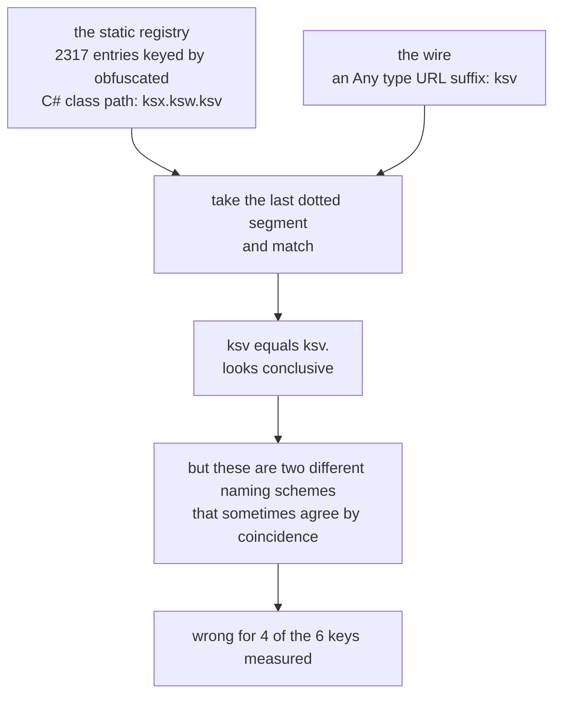
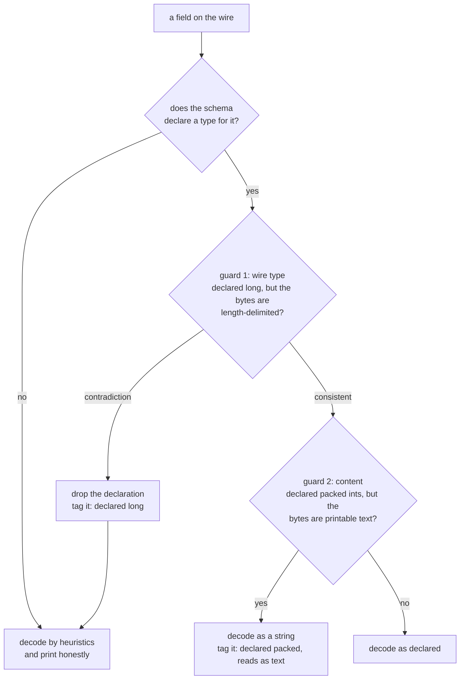
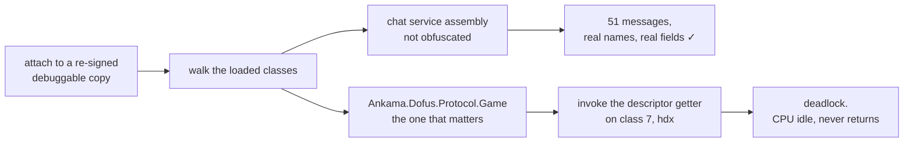

# Nine ways to fail at reading a schema out of a running game

*by Miou-zora · post 4 of 6 in [Notes from reverse-engineering a game protocol](README.md)*

> **The project.** [SniffSniffSquared](../README.md) reads the Dofus 3 game
> protocol off the wire, decodes it and writes what it understands to Postgres.
>
> **Where this sits.** Posts [01](01-the-traffic-was-never-encrypted.md) to
> [03](03-identifying-a-message-with-no-schema.md) are all workarounds for the
> same missing thing: a schema. Without one, a message is a bag of numbered
> fields, and post 03 recovers meaning by correlating those numbers against the
> game rather than by looking anything up.
>
> **What it answers.** The two attempts to stop working around it and get a real
> schema, one static and one from the running client. The static one is wrong in
> a way that reads as right. The runtime one works on 51 messages and deadlocks
> on the ones I need. This is the map of that failure, and the argument for
> keeping such a map in the repository at all.

The correct way to decode an obfuscated protobuf protocol is not to correlate
messages against in-game actions. It is to ask the client for its own
descriptors, which contain the real message names, the real field names, the
numbers and the types, and then to stop guessing entirely.

I built that. It works, end to end, on 51 messages. It deadlocks on the assembly
I actually need, and I have ruled out nine approaches to getting past it. This
post is the map of that failure, because a dead end with the evidence attached
is worth more than a dead end you have to rediscover, and because two of the
diagnostic traps I hit invalidated every measurement I had taken before finding
them.

## Failure one: the schema I already had was wrong in a way that looked right

Before the runtime route, there was a static one. An IL2CPP dump of the client
yields a registry of 2317 messages with their field numbers and C# types, which
`sniffer/proto/messages.json` holds.

The registry is keyed by obfuscated C# class path, like `ksx.ksw.ksv`. The wire
gives an `Any` type URL suffix, like `ksv`. Joining them means matching the last
dotted segment:



Two identifiers that look alike are not therefore the same identifier, and
**that join is often wrong**. Measured over one capture:

| key | mismatched fields |
|---|---|
| `ksv` | 3 |
| `jrj` | 1 |
| `kmw` | 1 |
| `jri` | 1 |
| `iwa` | 0, clean |
| `kdh` | 0, clean |

Four of six observed keys mis-joined. And this was measured *before* I
understood that keys rotate between builds, so the true cause is probably worse
than a bad join heuristic: the registry describes a build whose keys the wire no
longer uses, meaning a name that still resolves may now describe a completely
different message. Those numbers are a lower bound.

The insight that came out of it is the one I would keep from this whole project:

**A wrong schema is worse than no schema.**

With no schema, the decoder falls back to heuristics and prints something honest:
field 9 is length-delimited, here are its bytes. With a wrong schema, it
confidently pushes a string through the packed-integer path and prints
`packed [112, 108, 97, ...]`. That looks like a decoding bug in your own code.
It sent me looking for the bug in the wrong place more than once.

## So the decoder distrusts its own schema, out loud

The fix was to treat the schema as a hypothesis rather than an authority. Two
guards in `sniffer/src/dump.rs`:



Guard 2 exists because protobuf itself cannot help here: a packed integer array
and a string are both length-delimited, so the wire type alone cannot separate
them and only the bytes can.

**A wire-type check.** If the schema declares `long` and the wire says
length-delimited, those contradict. Drop the declaration for that field, fall
back to the heuristics, and say so:

```
declared = the schema's type for this field, if it has one

if declared exists and contradicts the wire type actually present:
    discard declared
    tag the field with: declared <that type>
    decode by heuristics instead
```

The comment above it in the source is the whole argument in three lines: a
schema that disagrees with the wire is worse than none, because it pushes
strings through the packed-varint path and prints digit soup.

**A content check**, because the wire type is not always enough. The schema is
precisely the thing under suspicion, so the bytes decide:

```
if declared is a packed array of scalars:
    if the bytes are valid UTF-8 and look like text:
        decode as a string
        tag the field with: declared packed, reads as text
    else:
        decode as packed numbers, as declared
```

That second guard is what rescued the chat messages. Output now looks like this,
with the disagreements tallied on the envelope so a mis-joined schema announces
itself:

```
Any <type.ankama.com/ksv> [ksx.ksw.ksv] <!! schema mismatch on 3 fields>
  2: varint 53207171425
  3: bool true
  7: string "2026-07-29T16:21:53+02:00"   <!schema: declared long>
  8: string "Player-Redacted-02"          <!schema: declared bool>
  9: string "<chat message text>"         <!schema: declared packed, reads as text>
```

Tests pin both directions, including the one that breaks quietly: genuine
packed data must still decode as numbers, so `packed [1, 2, 3, 4]` has to survive
the text heuristic untouched.

The principle generalises past protobuf. **When two sources of truth disagree,
prefer the observation, and make the disagreement visible rather than resolving
it silently.** A decoder that quietly picks one is a decoder you cannot debug.

## The obvious fix that would not have worked

The natural theory at this point is that `messages.json` has drifted: it was
dumped from an older client, the client updated, so re-dump it.

I checked before spending the afternoon. All 2204 obfuscated leaf tokens in the
registry are still present in the *current* client's metadata:

```
obfuscated leaf tokens in messages.json: 2204
still present in CURRENT global-metadata.dat: 2204
missing (drifted): 0 = 0.0%
```

Zero drift. The registry is not stale. **The mismatch is semantic**: the `Any`
type URL key and the obfuscated C# class leaf are not the same identifier, so
joining them by last dotted segment is wrong no matter how fresh the dump is.

Two hours of extraction avoided by ten minutes of counting. This is the cheapest
kind of negative result and the easiest to skip.

Only the runtime route fixes it, because there the `FullName` and the field list
come out of the same object and no join is required.

## Failure two: the runtime route works, then stops

The plan: attach to the running client, walk the loaded protobuf descriptors, and
pull each `.proto` file's serialized `FileDescriptorProto`. One blob per file,
carrying real names, real fields, real types and real nesting.



It works. Proven end to end on the chat service, which the obfuscator left
readable, 51 messages with real field names:

```
channel.ChannelMessage
  1  message_id          string
  2  channel_id          string
  3  created_timestamp   long
  4  content             string
  5  author              user.User
```

That output is what the whole project wants. Then the scan reaches
`Ankama.Dofus.Protocol.Game`, invokes the descriptor getter on the first class,
and the process goes to idle CPU and never returns.

Nine approaches, each tested on its own:

| tried | result |
|---|---|
| deferred via `setTimeout` (free thread) | blocks |
| deferred with `Il2Cpp.perform(..., "main")` | blocks |
| binary `send(payload, data)` | blocks |
| hex payload, O(n) encoder | blocks |
| synchronous at top level | blocks |
| skip the offending class | blocks on the next one |
| seed directly from `ksv`, no class scan | blocks |
| second attach to the same process | blocks |
| let the client sit idle for minutes first | blocks |

Row six is the informative one. It blocks on class 7, `hdx`. Add `hdx` to a skip
list and it blocks on `hdy`. So it is not one bad class, it is the shared static
initialisation behind all of them, and skipping will never converge.

## Trap one: my instrumentation was lying about whether it was running

Before those nine rows meant anything, I had to fix how I was measuring.

**Agent `console.log` output is queued during synchronous execution and only
delivered once the script yields. `send()` is delivered live.** All my progress
logging used `console.log`.

A working scan and a hung one therefore looked identical: silence, then either
output or nothing. I could not tell whether the scan was slow, stuck, or had
never started. Every reading taken before this was uninterpretable, and I did not
know it.

Switching the heartbeats to `send()` made the picture exact and immediate:

```
[hb] start                        scanned=0   msgs=0  files=0
[hb] Ankama.Dofus.Protocol.Game   scanned=7   msgs=0  files=0  INVOKING hdx
   <nothing further, CPU idle>
```

The rule I took away: **a diagnostic that shares a failure mode with the thing it
is diagnosing is not a diagnostic.** Before trusting any instrumentation output,
confirm it can distinguish "no progress" from "no reporting".

There was a related one in the same area. Looking up `get_Descriptor` and
`get_Parser` by name across 5644 classes finds **zero** messages in the game
protocol, because those accessors are obfuscated too, exposed as `coma` and
`colz`. But the lookup does not fail visibly, because the unobfuscated
chat-service assembly still matches by name. It returns results, so it looks like
it worked. Matching on signature instead, a static zero-argument method returning
`MessageDescriptor`, is stable across obfuscation.

## Trap two: the client I was testing against was never really running

This one invalidated more than the first.

The client ships with the hardened runtime and no `get-task-allow`, so under SIP
nothing can attach to it, including root. `sudo frida` fails outright. The
workaround is to re-sign a *copy* with the entitlement added, which is what
`sniffer/tools/resign-debug-app.sh` does, never touching the real install.

I was launching that copy from a scratch build directory. Dofus resolves its
Addressables catalogs relative to the launch directory, so it failed at boot:

```
ERROR [Addressables] (AddressableUtility:118) - Unable to find catalog list
Core.DataCenter.DataCenterModule:LoadData()
```

A window opens. It looks like a working client. But `DataCenter` never loads and
**no per-frame method ever runs**, so every conclusion drawn against that copy
was worthless, including one "let the client settle first" test and an early hook
probe that reported zero callbacks and which I had read as meaningful.

There is now a check that runs before anything else:

```sh
grep -c "Unable to find catalog list" ~/Library/Logs/Ankama/Dofus/Player.log  # want 0
tail ~/Library/Logs/Ankama/Dofus/Player.log                                   # want EventSystem:Update()
```

It also turned out the copy needs the launcher's arguments, not only the right
directory: a per-launch session hash, an IPC port back to the launcher, an
instance id. Given those, and launched from the real install directory, it boots
properly and runs alongside the actual client without disturbing it.

Which meant re-running every earlier test.

## What a correctly booted client changed, and what it did not

Running the extraction inside a hook on `EventSystem.Update`, so the code
executes on the game's own thread where the class-initialisation lock is already
held by us, moved the failure rather than removing it:

```
[hb] seed  INVOKING ksv
[hb] seed  SKIP ksv threw        <- throws instead of deadlocking
[hb] seed  INVOKING jrj          <- and the scan CONTINUES
```

`ksv` raises an exception instead of hanging and the loop moves on. `jrj` still
deadlocks. Thread context was a real part of the problem and not all of it.

Then, with the launcher arguments added so the client boots fully, the same code
crashes the process outright at `ksv`:

| context | client state | result |
|---|---|---|
| injected thread, sync | broken boot (no catalogs) | probe read `ksv` FullName, the only success |
| injected thread, sync | properly booted | deadlock, process idle |
| inside `EventSystem.Update` hook | properly booted, standalone | `ksv` threw, scan continued, `jrj` deadlocked |
| inside hook | properly booted, launcher args | hard process crash at `ksv` |

Four contexts, four different failures, and the only success came from the client
that was not actually working. That is the shape of a problem you do not
understand yet, and it is the honest place to stop.

## The instrumentation destroys what it measures

There is a harder constraint underneath all of this, and it is the reason I stopped
rather than pushed.

Harvesting descriptors from a logged-in session worked mechanically. The client
then segfaulted a few minutes later, mid-play. The crash report names the cause:

```
External Modification Warnings:  Thread creation by external task.
  task_for_pid: 4   thread_create: 1

Thread 0 Crashed:: com.apple.main-thread
0   ???                 0x360b050d4  ???          <- PC not in any mapped region
1   libunwind.dylib     _Unwind_RaiseException + 408
2   libc++abi.dylib     __cxa_throw + 84
3   GameAssembly.dylib  ...
```

IL2CPP threw a managed exception, the C++ unwinder walked the stack and jumped to
garbage. Frida's injected thread and patched frames break unwind information, and
IL2CPP throws routinely during normal play. This is a matter of when, not if.

And the two requirements are in direct tension. The heap harvest only sees
descriptors the client has already built, which needs a logged-in session.
Instrumenting a logged-in session destabilises it. That tension is what makes the
route a poor trade rather than merely difficult, and it is a different kind of
conclusion from "this is hard".

**Never attach to a client anyone is using.** Not a warning about lost work, a
warning about a crash mid-play.

## Where I would pick it up

Not with a tenth variation on invoking the getter. Every failure comes from
forcing the static constructor to run.

The alternative is to stop calling it. `MessageDescriptor` exposes
`<Proto>k__BackingField` and `<Fields>k__BackingField` as plain fields, confirmed
by probe. Reading a field runs no user code, so it cannot deadlock or crash the
runtime the way an invoke can. Only classes the game has already initialised will
hold non-null values, which is acceptable: seed from the messages actually seen
on the wire during a real session.

Worth checking at the same time whether the getter selection is even correct.
`ksv` exposes both a static `coma` and an instance `comb` returning
`MessageDescriptor`. If the wrong one is being called, the crash may be an
ordinary calling-convention mismatch and not a story about initialisation at all.

This is unfinished. `sniffer/proto/messages.runtime.json` exists, nothing consumes
it yet, and the `decoded` column in the packets table is still NULL.

## Why the table of failures is in the repository

Nine rows of "blocks" is not a result anybody enjoys writing. It is the highest
value-per-line documentation in this project.

Each row is an afternoon somebody does not have to spend, mine included. Twice I
have gone back to that table while forming a new idea and found the idea already
on it. The two traps are worth more still, because they are not "this does not
work" but "this appears to work and does not", and that is the class of thing
memory reconstructs wrongly.

**Ruling something out is a deliverable.** It only counts if you write down what
you actually tested, so the next person can tell whether their new idea is
genuinely new.

## Next

The same discipline applied to a number instead of a technique: how to tell the
difference between a value you have not found yet and a value that is not there,
and why the recycling dashboard deliberately shows nothing at all for equipment.

The full account is [`RUNBOOK.md`](../RUNBOOK.md) part 3, and the decoder guards
are in [`sniffer/src/dump.rs`](../sniffer/src/dump.rs).
