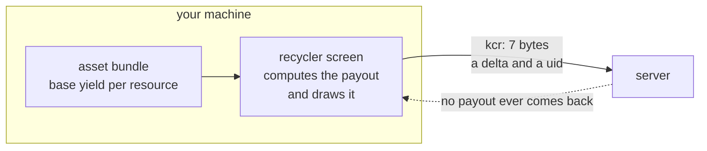
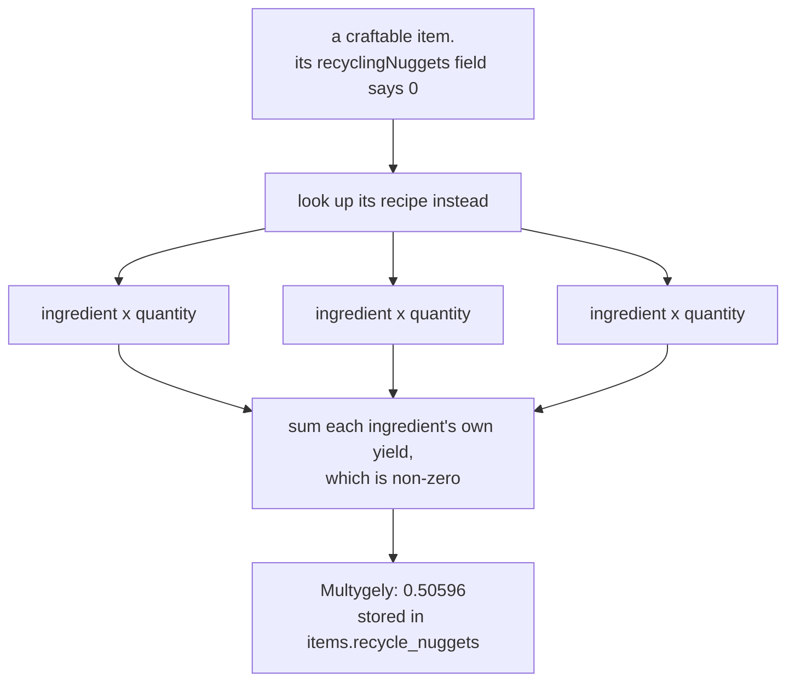
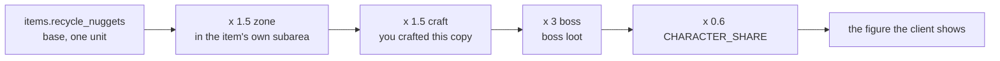
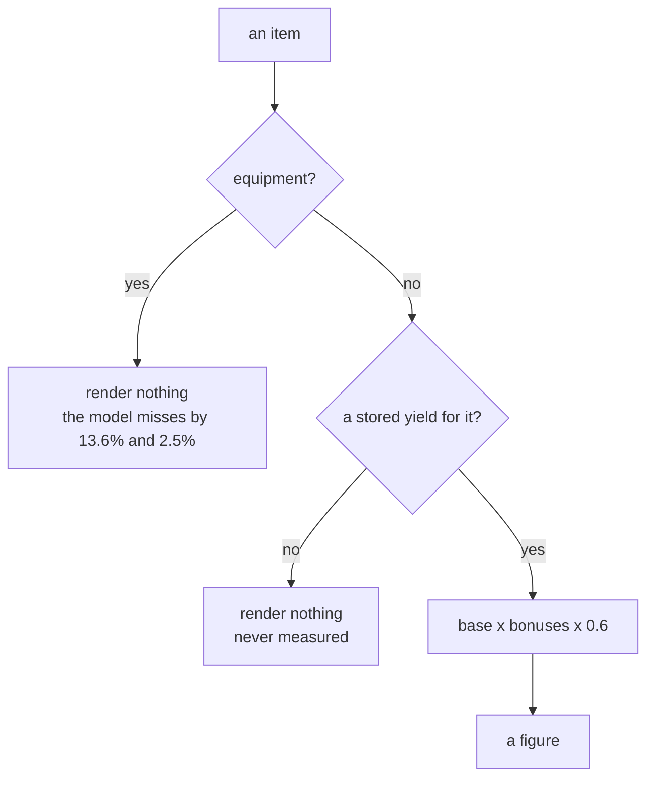

# Knowing when to stop: a number that was never on the wire

*by Miou-zora · post 5 of 6 in [Notes from reverse-engineering a game protocol](README.md)*

> **The project.** [SniffSniffSquared](../README.md) reads the Dofus 3 game
> protocol off the wire, decodes it into Postgres, and a dashboard turns those
> captures into trading decisions: what an item is worth broken down into runes,
> what a craft costs, which recipes pay.
>
> **Where this sits.** Posts [01](01-the-traffic-was-never-encrypted.md) to
> [04](04-nine-ways-to-fail-at-reading-a-schema.md) are all about getting values
> off the wire. Prices, item rolls, crush yields and bag contents all arrive
> that way, and the working assumption by this point is that if the client knows
> a number, the number crossed the network at some stage.
>
> **What it answers.** What to do when it did not. One value, the recycling
> yield, that is never transmitted at all, and three separate decisions to stop
> searching for it. The last of those is why the dashboard shows a blank space
> for equipment instead of a figure.

There is a difference between a number you have not found yet and a number that
is not there, and telling them apart is much of the skill in reverse
engineering. Get it wrong in one direction and you abandon something reachable.
Get it wrong in the other and you spend a week searching a haystack that
contains no needle.

The number here is the recycling yield: what the game pays you for turning an
item into nuggets. I searched for it on the wire, found it was not there, and
then found two further places the search could have gone wrong even after that.

## The thing I was looking for

Recycling converts an item into nuggets, which are a currency. The client shows
you what a unit will pay before you commit. My dashboard wants that figure so it
can compare recycling something against selling it, which for 94 of 373 known
items turns out to be the better exit.

The obvious plan: find the message where the server tells the client the payout,
decode it, store it. I had already done exactly this for marketplace prices,
crush yields and bag contents.

## Stop one: it is not on the wire, and here is the proof

The recycler produces one message when you place an item, `kcr`. It is seven
bytes:

- field 1, a signed quantity delta
- field 2, an instance uid

That is the whole body. Every byte accounted for, no trailing bytes, no room for
a third value. There is no payout in it because there is nowhere for a payout to
be.

**And it is client-to-server.** This is the argument that actually closes the
question, and it needs no byte-level work at all. The message travels from me to
the server. It cannot possibly be reporting a figure that my own client just
calculated and drew on my screen. Direction alone rules out the entire class of
"the server tells you the yield" hypotheses.

I went further than that, because a negative result is only worth writing down if
the search was thorough enough to be convincing:

- A 121-message recycler session, every message decoded field by field. No float,
  no scaled integer, nothing matching an observed payout.
- The whole packet archive searched for `4.5`, `2.70` and `0.46`, three payouts I
  had watched happen, as `f32` and as `f64`. Not present. Not once.

The conclusion is that the client computes the figure locally from its own asset
bundles, which is consistent with a broader pattern I had already established:
static game data never crosses the wire, because the server is only asked for
what it alone knows.

So the extractor reads the bundles instead. `tools/extract_nuggets.py` opens the
client's own data files, decomposes what it finds and fills a database column. It
reads the installation and never writes to it.

This search is closed. It is written into the ground-truth section at the top of
my `CLAUDE.md` in those words, with the evidence, specifically so that the next
time a yield is missing I do not reopen it.

## Stop two: the obvious data source is wrong in a way that reads as an answer

Both DofusDB and the client's bundle expose a `recyclingNuggets` field per item.
That looks like the end of the story. Read the field, store the field, done.

It is **0 for all 4511 craftable items.**

Not missing. Not null. Zero. And zero is a number, so a naive importer stores it
happily and every downstream consumer treats it as a real measurement.

The tell for why is in the client's own code, in one of the few classes the
obfuscator left readable: `RecycleUi.GetItemNuggets` takes a
`Dictionary<int, int> resources`, not an item. It does not read a per-item field
for craftables at all. It decomposes the item into the resources its recipe
consumes and sums *their* yields.

Now look at what storing the raw field would have done. It writes 0 for exactly
the items a craft dashboard cares about, and in this domain **0 does not read as
"not computed", it reads as "not worth recycling"**. The interface would have
been confidently wrong about precisely the rows the user came to check, with no
signal anywhere that a value was missing.

This is the same failure as the stale message key from post 02, in a different
costume. A value that fails loudly costs you a feature. A value that is wrong and
plausible costs you trust in the whole table.

The guard that followed is small and load-bearing: **DofusDB may only ever write a
non-zero value into that column.** In the read-time upsert that is
`NULLIF(EXCLUDED.recycle_nuggets, 0)`, so a zero from the API can never overwrite
a decomposed value computed from the bundles.

## The model, and what it gets right

With the base yield decomposed per item, the rest is multipliers the client
applies at display time. None of them are properties of the item, which is why
none of them are stored against one:

None of the three bonuses is a property of the item, which is why none of them
is stored against one. They depend on where you are standing, what you recycled,
and whether a boss was involved:

| multiplier | value | when it applies | source |
|---|---|---|---|
| zone | x1.5 | recycling inside one of the item's own favoured subareas | read from the client |
| craft | x1.5 | recycling a copy you crafted yourself | read from the client |
| boss | x3 | boss loot | read from the client |
| character share | x0.6 | always | **measured** |

That last row is the only figure I worked out rather than read: Rune Invo has a
base of 4.5 and paid 2.70, which is 60% exactly. It is kept as a named constant
because it is the one number here that could differ per account, so if payouts
ever stop matching, that is the first thing to change and the whole panel follows
it.

Here are all five measurements I have, kept next to the code that implements
them:

| item | base | bonus | predicted | the game showed | |
|---|---|---|---|---|---|
| Rune Invo | 4.5 own | x1 | 2.7000 | 2,70 | exact |
| Multygely | 0.50596 decomposed | x1.5 | 0.4554 | 0,46 | rounding |
| Essence du Craqueleur Légendaire | 0.20971 decomposed | x4.5 | 0.5662 | 0,57 | rounding |
| Gelano | 5.20199 decomposed | x1.5 | 4.68 | 5,32 | **+13.6%** |
| Marteau Ridhe | 36.5241 decomposed | x1.5 | 32.87 | 33,69 | **+2.5%** |

Every row also carries the x0.6 character share. The first three are consumables
and resources, and they land inside display rounding. The x4.5 on the Essence is the craft bonus times the boss bonus, 1.5 x 3, which
is the model composing correctly across two independent multipliers rather than
being fitted to that row.

The last two are equipment, and they are wrong.

## Stop three: two wrong numbers, and why I did not fix them

A Gelano reads 13.6% over the prediction. A Marteau Ridhe reads 2.5% over.

The instinct here is strong and it is worth naming: two errors in the same
direction look like one missing multiplier. Find the factor, multiply, done. I
wanted that to be true.

**Same direction, different magnitude.** 13.6% and 2.5% are not one factor. A
single missing multiplier would move both rows by the same proportion. Whatever
is happening on equipment is either two effects, or one effect that varies per
item, and neither of those is a constant I can go and find.

The obvious candidate was stat quality: equipment rolls within template ranges, a
copy that rolled high might recycle for more, and gear is the only category where
that applies at all. It fits the story neatly, which is exactly why I tested it
rather than adopting it.

It does not fit the data:

- The Marteau rolled **8.9% above its template weighted average**. To close a
  2.5% gap. That is nearly four times more roll quality than the gap needs, so if
  roll quality were the mechanism, that row would be far more wrong than it is.
- The Gelano's only templated line is **fixed at 1 and cannot roll high at all**.
  It has no roll quality to have. And it is the row that misses by 13.6%.

The candidate is not merely unsupported, it predicts the opposite of what was
measured. Whatever the factor is, it is not in the item data I have.

So the dashboard shows **no recycling figure for equipment at all.**

Three different reasons, one blank space. That was the second decision, and it
was deliberate: a caveat explaining a number that is not being shown takes more
room on screen than the number would have.

That was the harder decision than it sounds, because I had two measurements and a
free parameter, and two points determine a line. I could have fitted a per-item
correction and every number on the page would have matched every observation I
owned. It would also have been a curve fitted to five points, three of which are
a different category, and it would have generalised to nothing.

**A model that is right on consumables and silent on gear is more useful than one
that is right everywhere I have measured and unfalsifiable everywhere I have
not.**

The reasoning lives in the module, where the next person to open the file will
find it, rather than on screen where it would cost a paragraph per row.

## The same discipline, one layer down

The kamas model for crushing items has an outlier with the same shape, and it is
worth putting next to this one because the resolution went differently.

Five focused crushes, checked against the formula. Four land inside their
measured band with no fudge factor. The Cape Maj'Hic misses by 0.17 weight, which
is 0.15 runes.

Before treating that as a flaw in the model, I looked at the row. It is **also**
the one item whose captured stats contradict the reference data: the wire reports
Vitalité 22, Sagesse 7 and Puissance 2, while the template for item 779 says
Vitalité 31-40 and Puissance 7-10, with three resistances at 2 and no Sagesse at
all. The captured Vitalité falls *below* a range it is supposed to be inside.

So item 779 is not what the wire says it is. Its level comes from that same
reference data and drives every line weight in the calculation, so if the
identity is wrong the entire row is wrong, and the 0.17 is measuring my item
lookup rather than the formula.

The note in the document reads: *not worth chasing further without a second crush
on a cleanly identified item.* And the item is flagged as unsound wherever it
appears, so no future conclusion quietly rests on it.

One outlier, two possible explanations, and the difference between them is
findable. That is not the same situation as the equipment gap, where the two
explanations are "an unknown factor" and "a different unknown factor". Knowing
which situation you are in is the actual judgement.

## What a stopping decision has to contain to be worth anything

Every one of these is written down in the repository, and I have re-read all of
them since. The pattern that makes them useful:

- **What was searched, specifically.** Not "I looked for the yield" but "121
  messages decoded field by field, plus the whole archive searched for three
  known payouts as f32 and f64".
- **The structural argument, where there is one.** `kcr` is seven fully-consumed
  bytes and travels client-to-server. That closes more than any amount of
  searching, and it is one sentence.
- **The candidate explanation that was tested and failed.** Stat quality is the
  first thing anyone will propose for the equipment gap. Recording that it was
  measured, and that the Gelano cannot roll high at all, stops the same idea
  coming back every few months.
- **What would reopen it.** A second crush on a cleanly identified item. A third
  equipment measurement that discriminates between one factor and two.

Without that last one it is not a stopping decision, it is a surrender. With it,
it is a result: here is the boundary of what is known, here is how to move it.

The failure mode this prevents is the one I actually hit before writing any of
it down: re-deriving my own negative results, months later, having forgotten I
had already ruled something out. The ground-truth list at the top of my
`CLAUDE.md` and the "dead ends, do not repeat these" section of the runbook exist
to stop that, and they have.

## Next

The other half of the project: turning captured bytes into a number you can act
on. A profitability model transcribed out of a spreadsheet, the one `+ 1` in it
that cost me a session, and why verifying a formula against a real measurement is
harder than it sounds when the game rounds its output to integers.

The implementation is [`web/src/lib/recycle.ts`](../web/src/lib/recycle.ts) and
[`tools/extract_nuggets.py`](../tools/extract_nuggets.py).
