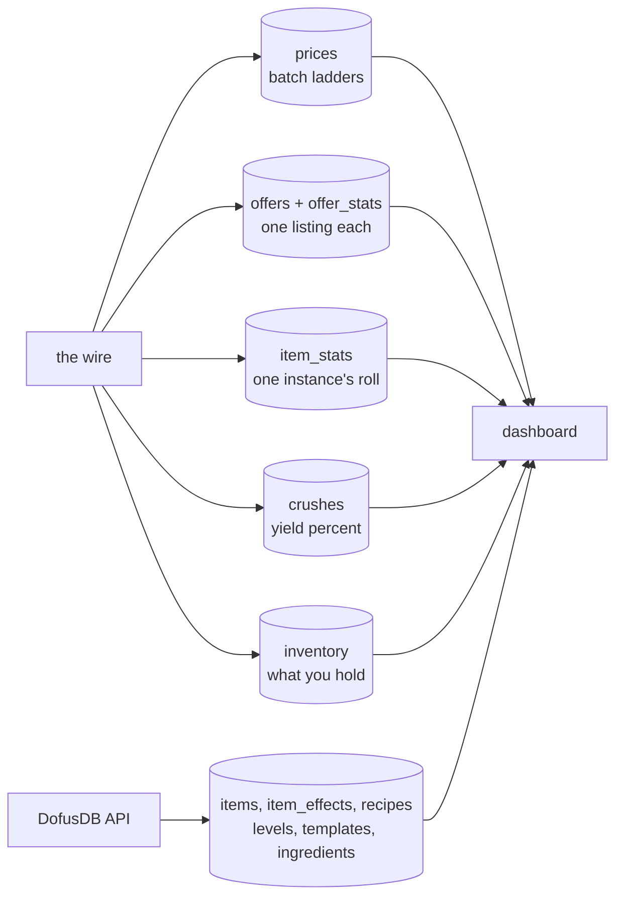
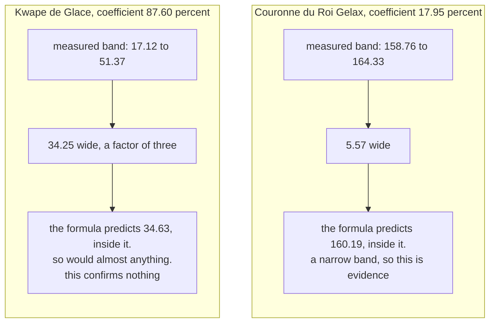
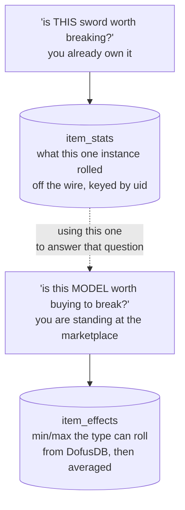
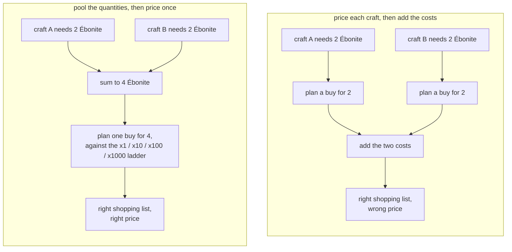

# From packets to a decision

*by Miou-zora · post 6 of 6 in [Notes from reverse-engineering a game protocol](README.md)*

> **The project.** [SniffSniffSquared](../README.md) reads the Dofus 3 game
> protocol off the wire and writes what it understands to Postgres. A Next.js
> dashboard reads that database back.
>
> **Where this sits.** Posts [01](01-the-traffic-was-never-encrypted.md) to
> [05](05-knowing-when-to-stop.md) are the capture half: getting bytes off the
> wire, working out which message is which, and knowing when a value is not
> there to be found. By the end of them the database is full of correct data.
>
> **What it answers.** The second half: the model that turns those rows into
> "yes, break this one", how it was verified against real crushes, and the four
> bugs along the way that all turned out to be the same bug.

A capture is not an answer. After a year of protocol work I had a database full
of correctly decoded marketplace prices, item rolls, bag contents and crush
yields, and I still could not tell you whether breaking a given item was worth
doing.

Turning those bytes into that answer was a second project, roughly the same size
as the first, and almost none of the difficulty was in the arithmetic. It was in
knowing which of two similar-looking tables answers which question, and in being
disciplined about the cases where the honest output is a dash.

[](../docs/screenshots/breaker.png)

What the wire supplies, what it cannot, and where the two meet:



The split is not arbitrary. The wire carries only what the server alone knows,
which in practice is prices and the state of your own account. Everything a
tooltip draws is static client data and never crosses the network at all, which
is [post 03's](03-identifying-a-message-with-no-schema.md) negative result and
why the right-hand branch exists.

## The model came out of a spreadsheet

Crushing an item in Dofus converts its stats into runes. How many runes depends
on the item's level, the value of each stat, a per-rune weight, and a
**coefficient** that the game rolls per crush. Focusing a stat converts part of
every other stat's weight into that one rune.

Somebody had already worked this out in a spreadsheet, `Book 3.xlsx`, which I had
and could not read: seven sheets, formulas referencing each other across columns,
last recalculated by a program that had not cached the results, so most cells
held a formula and no value. Column W of the input sheet holds broken `#REF!`
formulas left over from an earlier layout, computing nothing.

Transcribing it into `docs/brisage-model.md` was the point of the exercise: the
spreadsheet should not have to be reverse-engineered twice. Per stat line, with
`level` from the input sheet:

```
line_weight  = 3 * stat_value * rune_weight / stat_per_rune * level / 200 + 1

focus_weight = line_weight/2 + (sum of all line_weights)/2

runes        = focus_weight / rune_weight * coefficient / 100

value        = runes * rune_price

profit_ratio = (value * 100 / item_cost - 100) / 100
```

## The `+ 1` that cost a session

Look at the end of the first line. Every stat line gets a flat `+ 1` on top of
its computed weight, regardless of which stat it is.

It is the last term of one cell, after the level division, and it is the sort
of term you read past. I did. The predictions came out low, consistently, and the
error looked like this: too small by `(number_of_lines + 1) / 2`.

Across real items that is 2 to 3.5. **Close enough to a constant to look like a
missing constant.** I went looking for a fixed offset I had failed to transcribe,
which is a search that cannot succeed, because the term is not a constant. It is
per-line, and it only aggregates into something that resembles a constant because
the focus branch sums the lines.

That is the whole failure: an error that varies slowly can pass for an error that
does not vary, and then you look for the wrong shape of bug. It is the single
most useful paragraph in the model document, and it is at the top of the file.

## Verifying a formula against a game that rounds

Having the formulas is not the same as knowing they are right, and this is where
the work got more interesting than the arithmetic.

**The unfocused crush validates the formulas and cannot validate the `+1`.**

I had one clean capture: an Arc Anum, level 96, coefficient 32.185%, no focus.
Predicted against what the game actually returned:

| rune | predicted | actual |
|---|---|---|
| Ine | 23.49 | 23 |
| Age | 19.79 | 20 |
| Ini | 10.75 | 11 |
| Vi | 10.43 | 10 |
| Do Neutre | 2.38 | 2 |
| Do Feu | 2.38 | 2 |
| Ré Per Feu | 1.44 | 2 |
| Ré Per Neutre | 0.98 | 1 |

Every line within ±0.56, which is rounding. The formulas are correct.

But that crush says nothing about the `+1`, and saying so mattered more than the
result did. Without focus, each line is computed independently, so a flat per-line
term shifts every prediction by `1 / rune_weight * coefficient`. Here that is
under 0.33 runes, which is inside the rounding I just used to declare success. A
version of the model with the `+1` removed would produce the same table.

Eight rows of agreement, and the thing I most wanted to confirm is invisible in
all eight of them. Recording that is the difference between a verification and a
coincidence you have decided to trust.

**The focus branch pins it, and pins it to a band rather than a point.**

Focusing produces *only* the focused rune, no side runes, so the weight the game
used is directly measurable rather than inferred:

```
focus_weight = runes_obtained * rune_weight / (coefficient / 100)
```

Except the rune count is an integer. The game hands you 11 runes, not 11.34, so
each crush pins the weight to a band rather than a value:

```
±0.5 * rune_weight / (coefficient / 100)
```

A heavy rune or a low coefficient widens that band, sometimes past usefulness:



Five focused crushes:

| crush | focus | sheet formula | measured band | |
|---|---|---|---|---|
| Couronne du Roi Gelax, 17.95% | Vi | 160.19 | 158.76 - 164.33 | ok |
| Anneau Bsène, 47.85% | Vi | 67.35 | 65.83 - 67.92 | ok |
| Bâton d'Oubli, 76.94% | Vi | 24.44 | 24.04 - 25.34 | ok |
| Kwape de Glace, 87.60% | Invo | 34.63 | 17.12 - 51.37 | ok, band too wide to mean much |
| Cape Maj'Hic, 88.06% | Vi | 10.62 | 10.79 - 11.92 | 0.17 low |

Four of five land inside their band with no fudge factor, and the two competing
formulations are ruled out on every sample: `own + total/2` overshoots the
Couronne by 5.6 runes, and excluding the focused line from the sum is the worst
fit on every single crush.

The Kwape row is the one I want to point at. It agrees with the model. It also
agrees with almost any model, because its band spans a factor of three. Labelling
it *ok, band too wide to mean much* rather than counting it as a fifth
confirmation is the sort of bookkeeping that decides whether a table of five
results means anything.

The Cape Maj'Hic miss is discussed in the previous post: that item's captured
stats contradict its template, so the row is measuring my item lookup rather than
the formula.

**Lines that map to no rune are excluded entirely.** The Bâton d'Oubli carries a
`-{n} Intelligence` effect that corresponds to no rune. Excluding it completely,
so it contributes neither weight nor its `+1`, is what fits. Counting it as a
line in either sign does not. That is a rule discovered from one item and worth
exactly as much confidence as one item buys.

## Two tables that look like one

Now the data modelling, which is where most of the reusable engineering turned
out to be.



The dotted line is the mistake. There are two questions about an item's stats
and they need different tables:

- **`item_stats`** is what one *instance* actually rolled, off the wire, keyed by
  instance uid. The crush destroys the instance, so this row is the only record
  that copy ever existed.
- **`item_effects`** is what the item *type* can roll, min and max per line, from
  DofusDB. Averaging it estimates a copy you do not own.

Conflating them means judging an item you are about to buy by the roll of one you
happen to be holding. That is not a rounding error, it is answering a different
question: "is this specific sword worth breaking" and "is this model of sword
worth buying to break" have different answers, and the second one is the one you
ask at the marketplace.

The wire wins for the first. The reference data wins for the second. Neither
substitutes for the other.

## `prices` and `offers` are also two things, and I learned it expensively

Fungible resources sell in stacks, and the marketplace quotes them as a batch
ladder: a price for 1, for 10, for 100, for 1000. That goes into `prices`.

Equipment sells one copy at a time, because every copy rolled differently, and
the spread between the cheapest and the dearest listing of the same item is
routinely 100x. Its price is `min(price)` across the latest snapshot of listings.
That goes into `offers`, with each listing's rolled stats in `offer_stats`.

The wire distinguishes them with no guesswork required, which is a nice property:
an offer carrying stat lines is one specific copy, and a stack of resources has
none.

I did not know this at first, and my parser kept only the *last* offer in each
message. So a marketplace panel showing 34 listings collapsed into one row that
claimed to be the market price. **Item 6925 was recorded at 700 000 when the
cheapest of its 13 listings was 2 852.**

That is a 245x error in a number that feeds every profitability calculation in
the application, and it produced no warning of any kind. The row was
well-formed. It was an arbitrary seller's asking price wearing the name "the
market price".

Fixing the parser fixed nothing already collected. Replaying the packet archive
recovered 469 offers and 1 800 stat lines with no re-capture, which is the
archive from post 03 paying for itself again.

## Pool before you price

[](../docs/screenshots/craft.png)

The craft basket takes several recipes and produces one shopping list. The
obvious implementation is to price each craft and add up the results, and it is
wrong.

The marketplace prices 4 Ébonite differently from 2 Ébonite twice over, because
the batch ladder is not linear. So quantities are summed across every craft in
the basket **first**, and the buy planner runs once on the total.



Planning per craft prints the right shopping list at the wrong price. Both
versions look correct. Only one of them is the number you will actually pay.

What you already own comes off the top, too: each row carries what the bags hold
from the captured inventory, and the cost is for the shortfall, so a resource you
already have reads as settled and costs nothing.

## Refusing to guess is a feature

This is what all of the above is for. Every breakable item, valued for an
average copy, ranked by what breaking it pays against the cheaper of buying it
and crafting it:

[](../docs/screenshots/items.png)

Each row is the model from the top of this post, run over one item: the template
average from `item_effects` for what a copy will roll, rune weights from the
reference table, current rune prices from `prices`, and a coefficient from
`crushes`. The profit column is the last of those multiplied out and compared
against what the item costs.

Which is where the interesting decision is, because **a coefficient comes only
from an actual crush**.

[](../docs/screenshots/coverage.png)

92 items in my database have never been broken. There is no coefficient for them,
and there is no honest way to produce one. I could use the average of everything
measured. It would fill the column, the table would look complete, and every one
of those 92 rows would be arithmetic dressed up as a measurement.

They show dashes. The same table read the other way round is a coverage report:
here is what has never been measured, which is a genuinely useful view and only
exists because the gaps were left visible.

Those two questions were separate pages once. They turned out to be one table
with different columns hidden, and keeping them apart meant neither could sort by
the other's numbers while both grew the same filters. Chips pick the question now.

## The plumbing that makes it live

One implementation detail worth carrying away, because it is a leak that hides
well.

The dashboard updates when the sniffer inserts, with no polling: the sniffer's
writes fire Postgres triggers that `pg_notify`, a route handler relays those as
server-sent events, and the page refreshes.

**The LISTEN connection is shared process-wide, not one per client.** `LISTEN` is
connection state, so it cannot come from the pool, and a browser that dies
without a clean close does not reliably fire the request's abort signal. One
connection per subscriber therefore leaks on exactly the disconnections you
cannot control. I measured one surviving five minutes with nothing behind it.

Verified after the fix: five concurrent streams use one connection, and still one
after all five are killed with SIGKILL.

## What the second half taught me

The protocol work rewarded persistence. This half rewarded the opposite:
noticing when two things that look alike are different questions, and declining
to fill a column.

Every mistake in this post is the same mistake, four times over:

- the last offer instead of the cheapest
- the instance roll instead of the type average
- per-craft pricing instead of pooled
- an averaged coefficient instead of a dash

In each case the wrong version produced a plausible number and no error at all,
and the only defence is being explicit about which question a table answers.

That is also why the model document records what the Arc Anum crush *cannot*
confirm, and why the Kwape row is marked as too wide to mean much. A verification
you have not bounded is a verification you cannot rely on.

## The series

This is the last of six. The pipeline runs end to end: pcap, TCP reassembly,
adaptive deframing, `Any` unwrapping, protobuf decoding against a schema the
decoder distrusts on principle, into Postgres, out into a dashboard that says
what to break and what to craft, and says nothing where it does not know.

Ten message types are named out of 91 seen on the wire after the last rotation.
The largest unidentified one is a 68 to 80 KB server payload that is probably the
entire marketplace in a single message, which would be worth more than everything
already decoded. That is next.

The model is [`docs/brisage-model.md`](../docs/brisage-model.md), the
implementation is [`web/src/lib/brisage.ts`](../web/src/lib/brisage.ts), and
[`web/AGENTS.md`](../web/AGENTS.md) records the decisions behind the front end.
