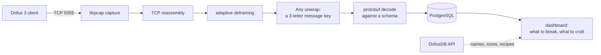

# Notes from reverse-engineering a game protocol

Six posts about [SniffSniffSquared](../README.md), a passive network sniffer for
the Dofus 3 game protocol and the trading dashboard built on what it captures.
The game speaks undocumented, obfuscated protobuf over TCP; the sniffer reads it
off the wire without touching the client, and Postgres holds the result.

These are written to explain rather than to announce. Most of what is worth
teaching here is the wrong turns: the diagnostic that shared a failure mode with
the bug it was diagnosing, the value that was 0 rather than missing, the schema
that was confidently wrong. Each post stands on its own, and they read in order.

## The system, and which post covers which part

Every stage above is one post's subject, and the last two posts are about the
things that are not stages at all:

| stage | the question it raises | post |
|---|---|---|
| capture, reassembly, **deframing** | how wide is a frame header, when nobody wrote it down? | [01](01-the-traffic-was-never-encrypted.md) |
| **`Any` unwrap** | the message key is 3 obfuscated letters, and they change | [02](02-the-names-rotate-every-patch.md) |
| **decode** | which key is which message, with no schema at all? | [03](03-identifying-a-message-with-no-schema.md) |
| **the schema itself** | can you get a real one out of the client? | [04](04-nine-ways-to-fail-at-reading-a-schema.md) |
| (nothing) | what if the number is not on the wire at all? | [05](05-knowing-when-to-stop.md) |
| **dashboard** | how do captured bytes become a decision? | [06](06-from-packets-to-a-decision.md) |

Read in order and each one picks up where the last stopped. Read one on its own
and its opening tells you what the earlier ones established.

## The posts

1. **[The traffic was never encrypted](01-the-traffic-was-never-encrypted.md)**
   Obfuscation is not a cipher, and neither is your own decoder reading signed
   varints as unsigned. Plus the one parameter that genuinely could not be read
   from a static dump, and the deframer that measures it at run time instead.

2. **[The names rotate every patch, and one of them lied about it](02-the-names-rotate-every-patch.md)**
   A client update took 141 message keys down to 19 survivors. One survivor kept
   its name and changed its meaning, which is worse than one that breaks. What
   rotates becomes data; what does not stays code.

3. **[Identifying a message when you have no schema, no source and no names](03-identifying-a-message-with-no-schema.md)**
   Known-plaintext search, action correlation, and the strongest of the three:
   using the packet archive as its own ground truth, 12 matches out of 12, with
   the game closed.

4. **[Nine ways to fail at reading a schema out of a running game](04-nine-ways-to-fail-at-reading-a-schema.md)**
   The runtime extraction route, proven on 51 messages and deadlocked on the ones
   that matter. Nine ruled-out approaches, two diagnostic traps that invalidated
   every earlier reading, and why the table of failures is in the repository.

5. **[Knowing when to stop: a number that was never on the wire](05-knowing-when-to-stop.md)**
   Telling a value you have not found yet from one that is not there. Three
   stopping decisions, and why the dashboard deliberately shows nothing at all
   for equipment.

6. **[From packets to a decision](06-from-packets-to-a-decision.md)**
   The other half: a profitability model transcribed out of a spreadsheet, the
   one `+ 1` in it that cost a session, and four bugs that were all the same bug
   wearing different clothes.

## If you would rather have the reference version

These posts are narrative. The repository's own documentation is not, and is
better if you are trying to run any of this:

- **[RUNBOOK.md](../RUNBOOK.md)** — the protocol guide. What the traffic is, a
  copy-pasteable command sequence, every trap, and what is still undone.
- **[README.md](../README.md)** — what the project is, how to run both halves,
  and the engineering notes in condensed form.
- **[docs/observations.md](../docs/observations.md)** — annotated real captures,
  byte by byte.
- **[docs/brisage-model.md](../docs/brisage-model.md)** — the kamas maths,
  measured against real crushes.

## What this is and is not

Passive observation of your own client's traffic, for interoperability research.
It sends nothing, modifies nothing, and automates no part of the game. Not
affiliated with Ankama. MIT licensed.

Every number in these posts traces to a file in this repository. Player names and
IP addresses in captured output are replaced with placeholders; the byte
sequences around them are real and self-consistent.

**Wire keys are not durable.** Any three-letter token quoted in these posts was
true for the build it was observed on and is probably wrong by the time you read
it. That is the subject of post 02.
