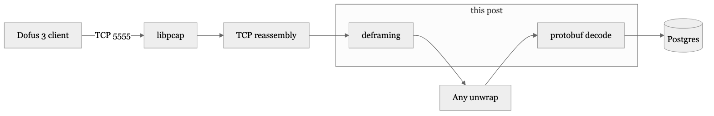
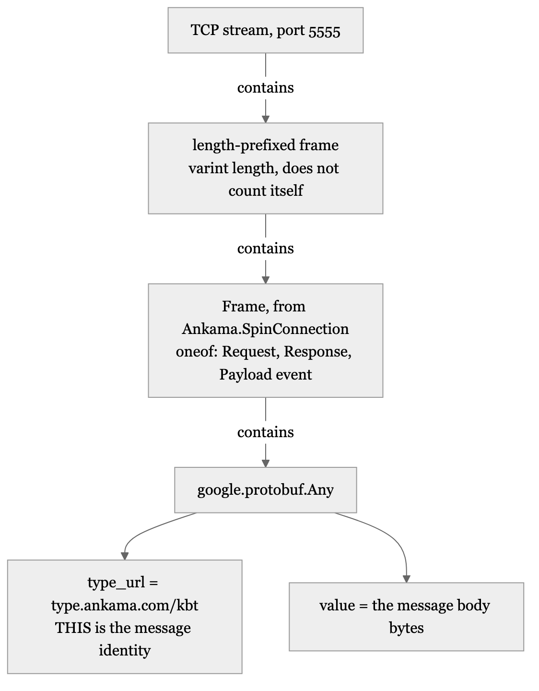
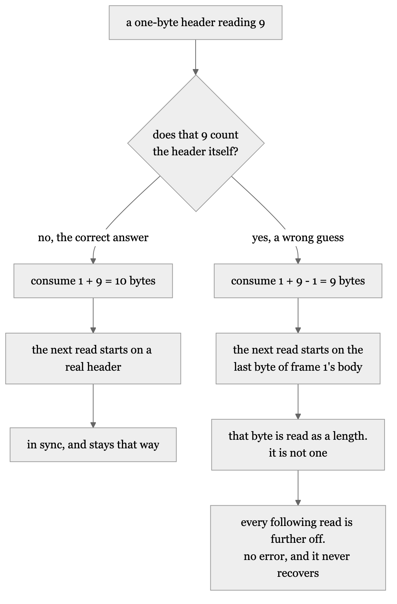
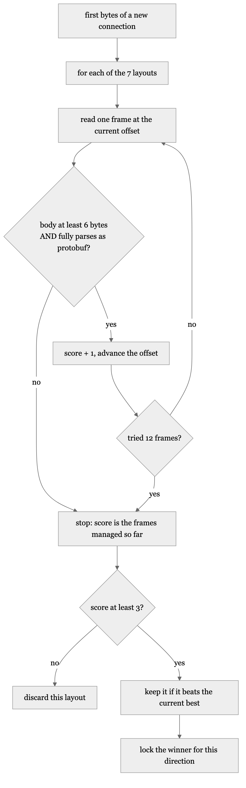

# The traffic was never encrypted

### Is the traffic encrypted, and if it is not, why did it look like it was for a week?

*Originally published in [Notes from reverse-engineering a game protocol](https://github.com/Miou-zora/SniffSniffSquared/blob/main/blog/README.md). Post 1 of 6.*

---

*by Miou-zora · post 1 of 6 in [Notes from reverse-engineering a game protocol](https://github.com/Miou-zora/SniffSniffSquared/blob/main/blog/README.md)*

> **The project.** [SniffSniffSquared](https://github.com/Miou-zora/SniffSniffSquared/blob/main/README.md) reads the Dofus 3 game
> protocol off the wire: libpcap capture on TCP 5555, TCP reassembly, protobuf
> decoding, into Postgres. It is passive. Nothing is injected, the client is
> never modified, and the game cannot tell it is there.
>
> **Where this sits.** First post. It assumes nothing except that you have seen
> a hexdump before.
>
> **What it answers.** Is the traffic encrypted, and if it is not, why did it
> look like it was for a week? Then the one part of the frame format that could
> not be read out of a decompiled client and had to be measured from live bytes
> instead.

Dofus 3 sends plaintext protobuf over TCP port 5555. I lost the first evening of
this project looking for a cipher that does not exist, because the decoder's
output looked like noise, and noise looks like encryption.

It was not a cipher. It was two ordinary problems wearing one costume: build
obfuscation, which renames things but hides nothing, and two bugs in my own
decoder. This post is about telling both of them apart from encryption, and
about the one piece of the wire format that genuinely could not be read out of a
static dump and had to be measured at run time instead.

Here is the pipeline, with the two stages this post is about marked:



## The hexdump that should have ended the search on day one

Here is a client-to-server frame, captured with `--raw` so nothing parses it:

```
[192.0.2.10:49788 -> 203.0.113.5:5555] seq=2809242277 len=42
  0000  29 22 27 08 ff ff ff ff ff ff ff ff ff 01 12 1a   )"'.............
  0010  0a 13 74 79 70 65 2e 61 6e 6b 61 6d 61 2e 63 6f   ..type.ankama.co
  0020  6d 2f 6b 61 67 12 03 10 fe 07                     m/kag.....
```

`type.ankama.com/kag` is sitting there in the ASCII column. Encrypted bytes do
not contain readable URLs. Player names, guild names, chat text and ISO
timestamps all arrive in the clear too, and I have since decoded a chat message
whose body carries `2026-08-04T10:42:38+02:00`, the author's name and the typed
text as plain ASCII.

So the first diagnostic on any protocol like this costs one command and settles
the question outright: dump the raw bytes and look at the right-hand column. If
you can read anything at all, stop looking for a key.

## Obfuscation renames, it does not hide

`kag` is a message type name. Ankama's build pipeline compiles the real names
down to three-letter tokens, so whatever the price-list message is actually
called inside `Ankama.Dofus.Protocol.Game` reaches the wire as `kea` or `kbt`,
depending on which build you captured.

That is obfuscation, and the distinction from encryption matters practically
rather than pedantically. A cipher means you need a key, and without it every
byte is opaque.

Obfuscation means every byte is still right there and what you have lost is the
*labels*. The body still decodes as protobuf, so you can count fields, read
varints and see the nesting, and the only thing missing is which message you are
looking at. That is recoverable by correlation rather than by cryptanalysis,
which is what post 03 in this series is about.

Peel one frame and the layering comes out like this:



One detail there cost me time and is worth stating loudly: **the message
identity is the `Any` type URL, not `Payload.id`.** There is an id map inside
the client, it is tempting, and older Dofus tooling chases it. Nothing in my
decoder uses it, and the type URL is what the server actually keys on.

## Your own decoder is the second thing that looks like a cipher

Both bugs that made the output look encrypted had the same shape: a correct byte
stream rendered through a wrong assumption, producing digits that no human would
recognise as data.

**Signed varints read as unsigned.** A correlation id came out as
18446744073709551615. That is not a nonce, a hash or a session token. It is
`-1` as a sign-extended `int64`, which protobuf encodes as ten `ff`-ish bytes:

```
08 ff ff ff ff ff ff ff ff ff 01
```

The same pattern appeared in a server message, `db e3 fe ff ff ff ff ff ff 01`,
which is another negative number. Once you have seen it, a varint whose bytes
are nearly all `0xFF` followed by `0x01` is a negative number every time. Before
you have seen it, it looks exactly like ciphertext.

**Raw bytes compared against decoded values.** My scratch notes recorded this as
an unexplained discrepancy between the wire and what the game displayed:

```
08 8a != 01 8A
03 c5 != 07 C5
0f a4 != 61 A4
```

There is no discrepancy. The left column is raw varint bytes and the right is
the decoded value written in hexadecimal. `8a 03` is little-endian base-128:
`0x0a | (0x03 << 7)` is 394. Likewise `a4 c3 01` is 24996, which is `0x61A4`,
which is the `61 A4` the game showed me.

The decoder had been right the whole time. I was comparing two different
representations and calling the difference corruption.

The lesson I would give my past self is narrow and useful: before you conclude
the data is scrambled, verify that both sides of your comparison are in the same
representation. Most "the protocol is encrypted" conclusions are "I have
not finished decoding it yet".

## The one thing that genuinely could not be read from the dump

Everything above was recoverable by reading. One parameter was not.

The connection layer prefixes every frame with a length header, and the static
IL2CPP dump does not pin down three things about it:

- how wide the header is (a varint, two bytes, four bytes),
- whether the length counts itself,
- whether a transport discriminator byte sits between the header and the `Frame`
  protobuf.

Three unknowns, and the failure mode is what makes them dangerous. Guessing the
length wrong by one byte does not throw an error. It consumes the wrong number
of bytes, which puts the next header at the wrong offset, which consumes the
wrong number of bytes again.



**The stream desynchronises permanently and silently after the first mistake.**
You get an endless run of plausible-looking garbage instead of a crash, which is
the worst possible way for a parser to be wrong: there is no error to catch and
no point at which it recovers.

## Seven candidate layouts, scored against real bytes

So I stopped guessing and made the deframer measure it. The three unknowns give
a small space of plausible layouts, and it enumerates all seven:

```
 #   header width     does the length count itself?   bytes to skip before the protobuf
---  --------------   -----------------------------    ---------------------------------
 1   varint           no                              0
 2   varint           no                              1
 3   u16 big-endian   no                              0
 4   u16 big-endian   no                              1
 5   u16 big-endian   yes                             0
 6   u32 big-endian   no                              0
 7   u32 big-endian   no                              1
```

Each one is then scored by how far it can walk the buffer before it fails:

```
for each of the seven candidate layouts:
    offset = 0
    score  = 0

    repeat at most 12 times:
        frame = read one frame at offset, assuming this layout
        stop unless frame is at least 6 bytes
                and parses completely as a protobuf message
        score  = score + 1
        offset = offset + bytes consumed

    if score >= 3 and score beats the best so far:
        best = this layout

lock best for this direction, and never re-detect
```

The same thing as a flowchart, which is how I actually think about it:



Three details in there are load-bearing.

**Consecutive frames, not one frame.** A wrong layout can parse a single frame
by luck, because a length byte that happens to be plausible produces a body that
happens to be a valid length. It cannot do it repeatedly, because each accidental
success moves the offset to a position the next accidental success would have to
be lucky at again. The scan tries up to twelve and requires at least three, and
the gap between "one by luck" and "three in a row by luck" is enormous.

**The body has to be substantial.** A frame only scores if it is at least six
bytes *and* consumes cleanly as protobuf, so a stray `0A 00` cannot count.
Without that condition, a layout that reads two-byte nothings would rack up a
perfect run of empty successes and win.

**It locks once, per direction.** The layout is detected on the first bytes of a
connection and then held. Re-detecting per frame would reintroduce exactly the
desynchronisation the scoring exists to prevent.

The result prints once per direction, within seconds of starting a capture:

```
[a.b.c.d:5555 -> w.x.y.z:NNNNN] framing locked: Varint includes_self=false lead_skip=0
```

That line is the single most useful piece of output the sniffer produces. If it
appears, real game traffic is being deframed and everything downstream has a
chance. If it never appears, nothing else you look at means anything, and the
cause is almost always the wrong capture interface rather than the protocol.

## What the run-time measurement was actually worth

On every build I have captured, the answer is the same one every time:
`Varint includes_self=false lead_skip=0`. The first candidate in the list. I
could have hardcoded it and shipped the same behaviour.

That is not an argument against having measured it. I did not know it was the
first candidate until the scoring told me, and I would not have trusted a
hardcoded guess afterwards because the failure mode does not announce itself.
The general shape is worth keeping: **when a parameter is unknown, and getting it
wrong fails silently rather than loudly, determine it from the data at run time
instead of picking one and hoping.** The cost is a table of seven layouts and a
scoring loop. The alternative is a class of bug that presents as "the protocol
must be encrypted".

Which is where I came in.

## Next

Everything above assumes the three-letter key you decoded yesterday still means
the same thing today. It does not. The next post is about the game update that
rotated 141 message keys down to 19 survivors, and about the survivor that kept
its name and changed its meaning, which was the one that could have quietly
corrupted a database.

The code is in [`sniffer/src/framer.rs`](https://github.com/Miou-zora/SniffSniffSquared/blob/main/sniffer/src/framer.rs), and
[`RUNBOOK.md`](https://github.com/Miou-zora/SniffSniffSquared/blob/main/RUNBOOK.md) part 1 is the reference version of everything here.

---

Passive observation of your own client's traffic, for interoperability research.
It sends nothing, modifies nothing, and automates no part of the game. Not
affiliated with Ankama. MIT licensed.

Every number in these posts traces to a file in this repository. Player names and
IP addresses in captured output are replaced with placeholders; the byte
sequences around them are real and self-consistent.

**Wire keys are not durable.** Any three-letter token quoted in these posts was
true for the build it was observed on and is probably wrong by the time you read
it. That is the subject of post 02.
