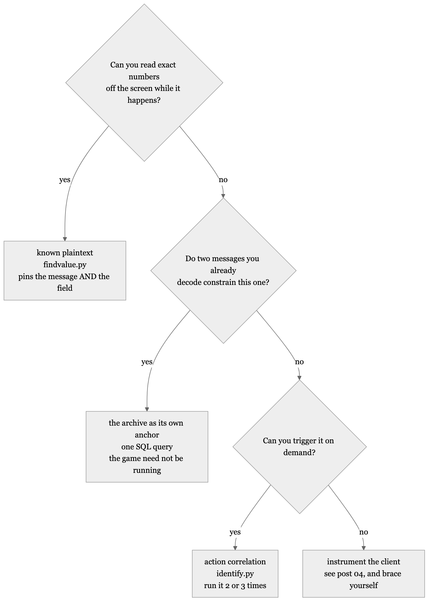
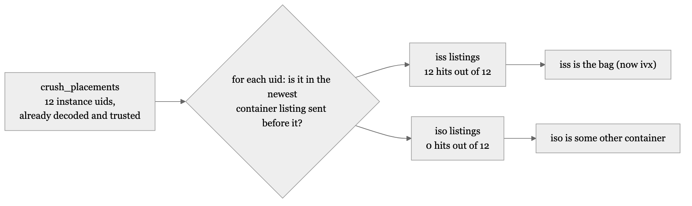
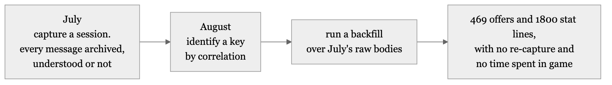

# Identifying a message when you have no schema, no source and no names

### That step. Given opaque bytes labelled `iua`, `ivj` and `ium`, how do you work out which is which, with no protocol specification, no field names, and without touching the client? Three techniques demonstrated here, ranked, plus a fourth that this post only names, and the storage decision that makes all of them work on traffic you captured before you knew what you were looking for.

*Originally published in [Notes from reverse-engineering a game protocol](https://github.com/Miou-zora/SniffSniffSquared/blob/main/blog/README.md). Post 3 of 6.*

---

*by Miou-zora · post 3 of 6 in [Notes from reverse-engineering a game protocol](https://github.com/Miou-zora/SniffSniffSquared/blob/main/blog/README.md)*

> **The project.** [SniffSniffSquared](https://github.com/Miou-zora/SniffSniffSquared/blob/main/README.md) reads the Dofus 3 game
> protocol off the wire, decodes it and writes what it understands to Postgres.
>
> **Where this sits.** [Post 01](https://github.com/Miou-zora/SniffSniffSquared/blob/main/blog/01-the-traffic-was-never-encrypted.md) got
> frames off the wire and showed that each one carries a three-letter message
> token. [Post 02](https://github.com/Miou-zora/SniffSniffSquared/blob/main/blog/02-the-names-rotate-every-patch.md) showed those tokens
> rotating between client builds, and ended on a step it did not explain:
> *"re-identify ten keys empirically, one deliberate in-game action each"*.
>
> **What it answers.** That step. Given opaque bytes labelled `iua`, `ivj` and
> `ium`, how do you work out which is which, with no protocol specification, no
> field names, and without touching the client? Three techniques demonstrated
> here, ranked, plus a fourth that this post only names, and the storage
> decision that makes all of them work on traffic you captured before you knew
> what you were looking for.

After the client update in the last post I had ten message types to re-identify
and nothing to identify them with. No protocol specification, no field names, and
a schema registry keyed to a build the wire no longer used.

I got all ten back, one deliberate in-game action each, using three
techniques. The strongest of them needs nothing on screen at all: it treats
the packet archive as its own ground truth, which turned out to be possible
because of a storage decision made months earlier for unrelated reasons.

Which technique applies depends on what you can observe, so here is the whole
post as one decision:



## Known plaintext: read numbers off the screen and search for them

If you can see exact values in the game, you have known plaintext, and known
plaintext is the strongest tool available here.

`sniffer/tools/findvalue.py` takes numbers and searches every archived message
body for them encoded as protobuf varints:

```sh
sniffer/tools/findvalue.py 394 1989 24996
```

This is how `price_list` was found. The marketplace shows an item's price at four
batch sizes: x1, x10, x100, x1000. I read all four off one item, passed them in,
and one 25-byte message contained all four together. There is no ambiguity in
that result. A message carrying four specific numbers that I chose from a single
screen is the message that carries those numbers.

The technique has one rule and it is in the tool's own docstring:

> A single small number matches noise everywhere -- one-byte varints appear in
> almost every message. Pass three or more values from the same screen and rank
> by how many co-occur; that is what makes the result trustworthy.

Pass one value and you will get dozens of hits, because small varints are
everywhere. Pass three from the same screen and the co-occurrence does the work.

The other reason to prefer this method: it identifies the *field*, not only the
message. You know which position held 24996, so you have half a schema before
you have started.

## Action correlation: do one thing and see what appears

Some messages carry nothing you can read. A container listing, an entity update,
a heartbeat. For those, correlate against an action instead.

`sniffer/tools/identify.py` samples a quiet baseline, waits while you do one
specific thing in game, then reports keys that are new or that spiked above
background:

```sh
sniffer/tools/identify.py "open HDV and click several item prices"
```

Two things make the output trustworthy rather than suggestive.

**Run it two or three times for the same action.** Background chatter varies
between runs; the key you want appears every time. This is the whole of the
technique. A key that shows up once is a coincidence you have not measured yet.

**Direction is a free discriminator.** Client-to-server messages are your
actions. Server-to-client messages are world state. That halves the candidate set
before you have looked at a single byte, and it settles arguments: a message
cannot be reporting a result to you if you were the one who sent it. I use that
again in post 05, where it closes an entire line of enquiry.

The re-identification after the 2026-08-04 rotation was ten runs of this, one
action apiece:

```
the action                     client sends  server answers              identified as
---------------------------------------------------------------------------------------------
browse a marketplace category  `kdk`         `kda` — the item ids in it  (unnamed)
ask the price of one item      `keh`         `kbt` — the ladder          `price_list`
buy a listing                  `kbm`         `kgv` — purchase confirmed  (unnamed)
put an item in the breaker     `kcr`         `kfb` — the item's detail   `item_detail`
crush it                       `kbj`         `kfp` — the yield           `crush_result`
send a chat line               `ktm`         `kti` — the broadcast       `chat_message`
(none, unprompted)                           `ivx` — the whole bag       `inventory`
(a stack arrives)                            `iua`                       `inventory_add`
(a stack changes size)                       `ivj`                       `inventory_quantity`
(an instance leaves)                         `ium`                       `inventory_remove`
```

"(unnamed)" means the exchange was pinned down but never given a semantic name in
`sniffer/src/messages.rs`, because nothing reads or stores it yet.

`kti` was free. Its body carries an ISO timestamp, the author's name and the
typed text in plain ASCII, so it identified itself the moment I looked at it.

## The archive as its own ground truth

The four inventory messages are the interesting case, because a bag listing
contains nothing I can read off the screen and does not correspond to a single
deliberate action. The server sends several large container listings and I had no
way to tell which one was the bags.

Except I did, and it had been sitting in the database for weeks.

This particular walkthrough is from the previous build, before the rotation in
the last post: the bag was `iss` and the removal was `ivf`, the same two
messages post 02's table shows becoming `ivx` and `ium`.

Every item I have ever put into the item breaker is, necessarily, an item I was
carrying. And `crush_placements` already records the instance uid of each one,
because that message was identified earlier. So the question becomes a join:

> For each placement, does the newest container listing before it contain that
> uid?



**12 placements. 12 hits in `iss`. 0 in `iso`**, the other large container
listing the server sends. Nothing else in the capture holds that set of uids.

`ivf` (now `ium`) fell out of the same anchor from the other direction: the
crushed uid turns up in one of those messages 1 to 11 seconds after each
crush, 8 times out of 8.

Both are a single SQL query. Neither needed the game running, neither needed a
schema, and neither needed me to read anything off the screen. I re-ran the same
test after the rotation against one purchase, which is even cheaper: the bought
Palmano's uid 2447309 appears in exactly one `ivx` and in no other container
listing.

What makes this work is that **the archive already contains verified anchors**.
Once any one message is identified with certainty, the ids inside it become
known plaintext for every other message. `crush_placements` was the anchor here.
The identification propagates.

I would generalise it as: before reaching for instrumentation, check whether two
things you have already decoded constrain a third. They frequently do, and the
check costs one query.

## The decision that made all of this possible

None of the above works without the archive, and the archive exists because of a
choice that looked like over-collection at the time.

**Every message is written to the `packets` table, decoded or not**, via
`Dispatcher::on_any`. Interpreted messages go on to their own tables; the
uninterpreted ones still get their raw `body` stored. It is append-only, it is
large, and it is the single highest-value thing in this project.



The payoff is that **identification is retroactive**. A key identified next month
decodes traffic captured today. You do not have to be in-game at the moment a
message appears, and you do not have to re-run a capture session to test a new
parser.

That is not theoretical. Three backfill scripts exist for exactly this, and the
one for marketplace listings recovered **469 offers and 1 800 stat lines on its
first run**, from packets collected before anything in the codebase knew what a
marketplace listing was.

There is a bug story attached to that number, and it is the best argument for the
archive I have. My price parser originally kept only the *last* offer in a
message, so a marketplace panel showing 34 listings became one row claiming to be
the market price. Item 6925 was recorded at 700 000 when the cheapest of its 13
listings was 2 852. That is not a small error, it is a 245x error, and every
downstream calculation using it was wrong.

Fixing the parser fixed nothing already collected. Running the backfill over the
archive recovered all of it, with no re-capture and no time in game.

The insert path is also deliberately defensive about not disturbing the thing it
protects: archiving uses its own Postgres connection, and insert failures are
rate-limited to one line per hundred, so a database that goes down cannot drown
the capture in error output or stall it.

## Reading a field number without guessing

Identifying the message is half the job. You then need to know which field is
which, and after a rotation you need to know it again.

The technique that works is the same known-plaintext idea aimed at structure
instead of identity: pick an item whose template you already know from an
external source, and let the ranges disambiguate the positions.

Palmano is item 8872. DofusDB says it rolls Initiative 101-150, Agilité 16-20 and
Invocation 1-1. I bought this copy off the marketplace and later put it through
the breaker, and both moments are in the capture, which is what lets the same uid
be checked twice. Its `item_detail` on the wire:

```
0a22 083f 2a1e
  08 a845                 item 8872
  1205 20 70 58 ae01      {4: 112, 11: 174}   Initiative 112, in 101-150
  1204 20 10 58 77        {4: 16,  11: 119}   Agilité 16,    in 16-20
  1205 20 01 58 b601      {4: 1,   11: 182}   Invocation 1,  in 1-1
  1801                    quantity 1
  20 cdaf9501             uid 2447309
```

Three stat lines, three known ranges, and exactly one arrangement that fits:
value at field 4, effect id at field 11. There is nothing left to guess. 112 has
to be the Initiative because 174 is not in 101-150 and 112 is; the Invocation
line pins itself because its range is a single value.

Then it confirms from the other end. Crushing that same uid returned Ini x20,
Invo x2 and Age x28: the same three effects, arriving through an entirely
different message. One capture of one known item pinned the whole shape.

## The negative result that saved the most time

The most valuable thing I learned in this phase was where to stop looking.

**Static game data never crosses the wire.** Recipes, template stat ranges,
anything a tooltip draws: the client already has it in its own data files, and
the server is only ever asked for what it alone knows, which in practice means
prices.

I did not assume that. Three probes, all negative, all on captures verified to
span the action:

- Opening an item's craft description (Chapeau du Vulkain, item 12417) sent
  nothing containing its eight ingredient ids. 970 messages searched in the
  window, in varint, zigzag, fixed32 and fixed64 encodings.
- Its template ranges (`41..60`, `26..35`, `11..15`, and the rest) appear in no
  message alongside the item id. Item 12417 occurs in exactly two message types
  across 23 790 messages, and neither carries stats.
- Opening the job workshop produced two messages of two bytes each: a request and
  its acknowledgement.

What the click *does* produce is a price query per ingredient and a price answer,
which is why browsing a craft panel fills the `prices` table for exactly the
ingredients you need and nothing else.

Three negative probes, written down once, with the search parameters recorded so
nobody has to trust my memory of how thoroughly I looked. Recipes and stat
ranges come from DofusDB instead. That is a better source anyway, and knowing it
is the *only* source stops the search from reopening every time something is
missing.

## The techniques, ranked

The sections above ran in the order I reached for them; this list orders the
same three by strength, plus the fallback this post does not demonstrate.

1. **Known plaintext** when you can read exact values. Identifies the message and
   the field, works on already-captured traffic, unambiguous with three or more
   values from one screen.
2. **The archive constraining itself** when two decoded messages pin a third.
   Costs one query, needs no game session, and produced the cleanest result here
   at 12 of 12.
3. **Action correlation** when you can trigger a message but cannot read
   anything. Needs repetition to separate signal from chatter.
4. **Instrumenting the client.** Last, and post 04 is about why.

## Next

There is a proper way to do all of this: extract the real schema from the running
client, with real message names and real field names, and stop correlating
entirely. I built it. It works on part of the protocol and deadlocks on the part
I need. The next post is nine ruled-out approaches, two diagnostic traps that
invalidated a week of readings, and the argument for writing dead ends down.

The tools are [`sniffer/tools/findvalue.py`](https://github.com/Miou-zora/SniffSniffSquared/blob/main/sniffer/tools/findvalue.py) and
[`sniffer/tools/identify.py`](https://github.com/Miou-zora/SniffSniffSquared/blob/main/sniffer/tools/identify.py); the procedure is
[`RUNBOOK.md`](https://github.com/Miou-zora/SniffSniffSquared/blob/main/RUNBOOK.md) part 2 step 6.

---

Passive observation of your own client's traffic, for interoperability research.
It sends nothing, modifies nothing, and automates no part of the game. Not
affiliated with Ankama. MIT licensed.

Every number in these posts traces to a file in this repository. Player names and
IP addresses in captured output are replaced with placeholders; the byte
sequences around them are real and self-consistent.

**Wire keys are not durable.** Any three-letter token quoted in these posts was
true for the build it was observed on and is probably wrong by the time you read
it. That is the subject of post 02.
